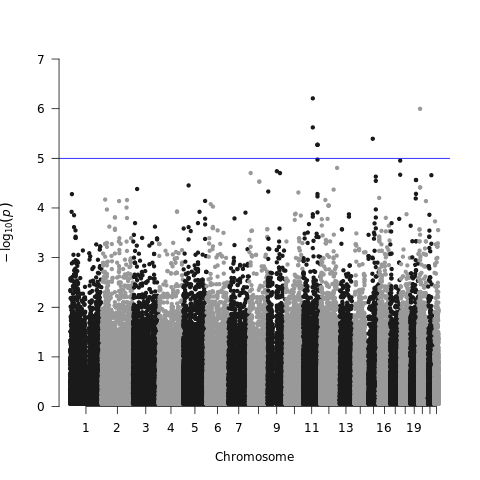
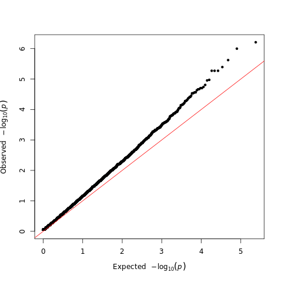
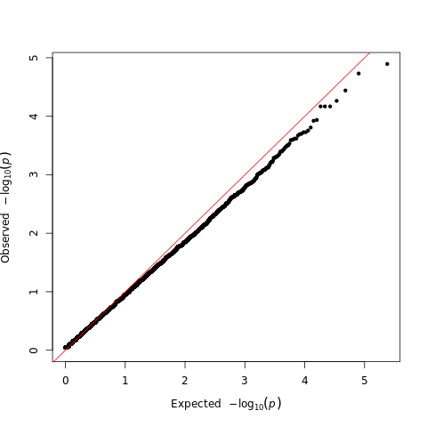
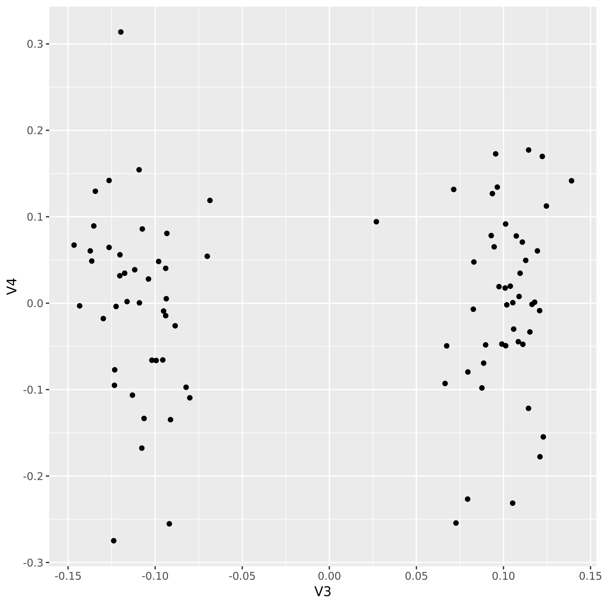
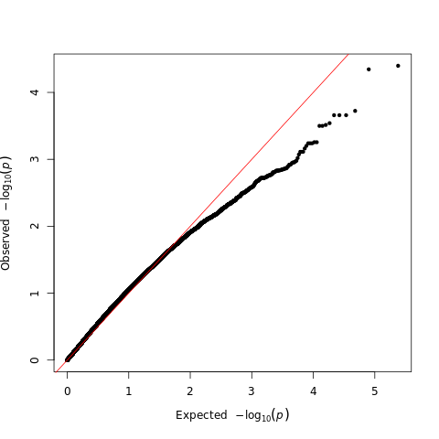

# Association testing using PLINK

### Software:
We will be using plink 1.9, you can see the documentation [here](https://www.cog-genomics.org/plink/1.9/).
We will also be using R and Rstudio to make plots and make simple calculations.

### Data:
We will use a simulated date set of 47 cases and 41 controls. You can find it in:

```bash
/home/Data/GWAS_test
```
Copy the contents of the folder to your home.

### Exercise contents:
In this practical, we will go through the steps of performing association tests in plink and adjusting for principle components.

### Test for association with disease status using a Fisher’s exact test
To test for association between SNPs and disease status using an allelic Fisher’s exact test, type the following command at the shell prompt:
```
plink --bfile GWAS_test --fisher --out GWAS_test
```
*1) Take a look at the output file “gwa.assoc.fisher”. What is the p-value and location of the most significant variant?*

```
  CHR        SNP        BP A1     F_A    F_U A2         P      OR
1  11  rs2513514  75922141  A 0.52130 0.1585  G 6.189e-07 5.77900
```

*2) Is the most significant variant significant if you do Bonferroni correction?*

Assume a significance level of 5%. We have 119615 SNPs, this makes the alpha = 4.180078e-07.

The P value is 6.189e-07, which is *not* significant.

### Make plots
We will use the R package “qqman” to make Manhattan plots and qq-plots. The package is available in CRAN so it can be installed using the “install.packages” command. You can read in the association results and make a Manhattan plot by typing:
```
d <- read.table('gwa.assoc.fisher', head=T)
manhattan(d)
```


*3) Are there other variants close to the most significant variant that are also associated with the disease?*

Yes there are 2 others.

To make a QQ-plot you should use the “qq” function:
```
qq(d$P)
```
*4) Is there a general inflation of the test statistic?*

### Genomic Control.T
The inflation factor (𝝺) can be calculated as the median of the Chi-squared statistics computed divided by the median of the Chi-squared distribution under the null. Given a p-value (p) the corresponding Chi-squared quantile can be calculated as:

Yes, there seems to be a general inflation


### Genomic Control.
The inflation factor, 𝝺 , can be calculated as the median chi-square value divided by 0.456. Given a p-value, p, the corresponding Chi-square can be calculated as:
```
qchisq(p, df=1, lower.tail = F)
```

```
 median(qchisq(df$P, df=1, lower.tail = F))
[1] 0.5955004
```

*5) What is the inflation factor?*

To do genomic control (to adjust for inflated test statistic) you divide the Chi-squared values by the inflation factor. To turn a Chi-squared quantile (q) into a p-value you use the “pchisq” function:
```
0.595 / 0.456 = 1.305
```

To do genomic control (to adjust for inflated test statistic) you divide the chi-square values with the inflation factor. To turn a chi-square value, q, into a p-value you use the “pchisq” function:

```
 pchisq(q, df=1, lower.tail = F)
```

```
 df <- df %>%
   mutate(Q = qchisq(P, df=1, lower.tail = F)) %>%
   mutate(Qcor = Q / 1.305) %>%
   mutate(Pcor = pchisq(Qcor, df=1, lower.tail=F))
```

*6) What is the p-value of the most significant marker after genomic control?*

```
  CHR        SNP        BP A1     F_A    F_U A2         P      OR        Q      Qcor         Pcor
1  11  rs2513514  75922141  A 0.52130 0.1585  G 6.189e-07 5.77900 24.85246      19.04403 1.277367e-05
```


### PCA
It is best to perform the PCA on a LD-pruned set of SNPs:
```
plink --bfile gwa --indep-pairwise 500kb 5 0.2 --out gwa
```
To use the pruned set of SNPs to calculate the relationship matrix and calculate the first 20 principle components (PCs) type:
```
plink --bfile gwa --extract gwa.prune.in --pca 20 --out gwa
```
This calculates the eigenvalues and the eigenvectors, and stores them in two files (gwa.eigenval, gwa.eigenvec).

*7) Load gwa.eigenvec into R and make a plot with the first PC on the x-axis and the second PC on the y-axis. Does it look like there is population structure in the data? How many populations?*



Two populations!

The eigenvalues divided by the number of individuals should correspond approximately to the variance explained by the eigenvectors.
 
*8) How large a percentage of the variance does the first PC approximately explain?*

```
 df3[1,] / nrow(df2)
[1] 0.01913159
```

So 1.9 % of the variance. (1.2 % for the next)

### Adjusting for PCs
We can use a logistic regression test to perform an association test while correcting for covariates. To include the first PC as a covariate type:

```
plink --bfile gwa --logistic --covar gwa.eigenvec --covar-number 1
```

The resulting file “plink.assoc.logistic” contains p-values for both the SNPs and the covariates. To get the p-values for the SNPs should look at the rows with the value “ADD” in the “TEST” column. (It is possible to include more PCs. To include the first x covariates you can write “--covar-number 1-x”.)

*9) Create Manhattan plot and QQ-plot for the new results. Does the QQ-plot look better?*



*10) What is the inflation factor now?*

```
 median(qchisq((df4 %>% filter(TEST=="ADD"))$P, df=1, lower.tail = F))
[1] 0.5312067
```

```
0.531 / 0.456 = 1.164
```
